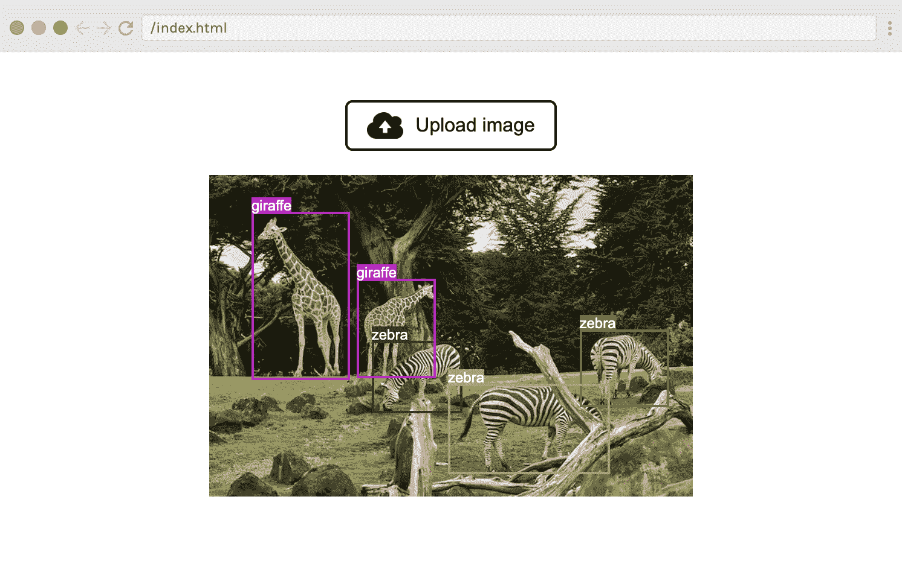
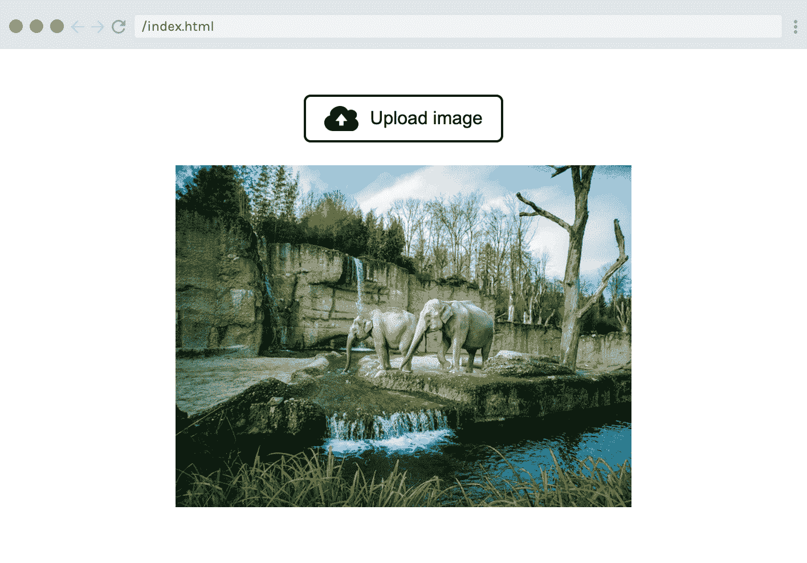
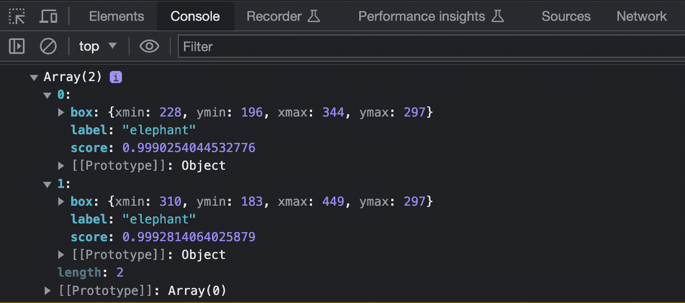
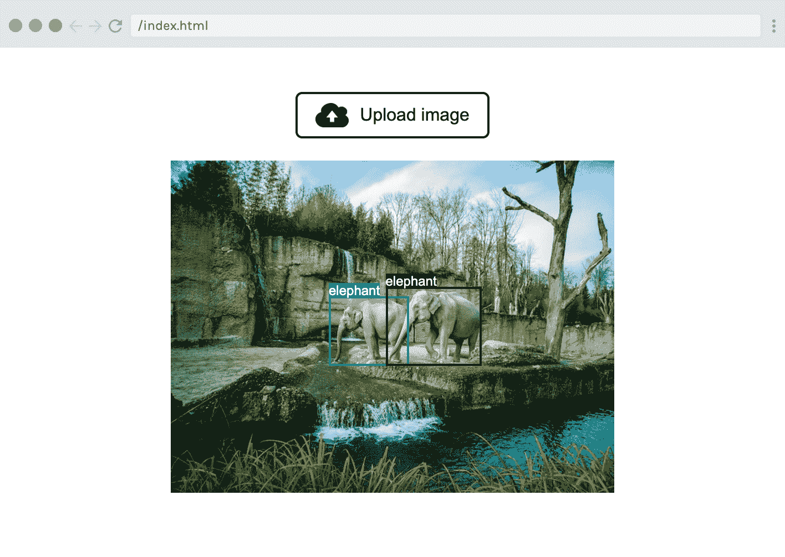

# 构建一个原生 JavaScript 应用程序

> 原始文本：[`huggingface.co/docs/transformers.js/tutorials/vanilla-js`](https://huggingface.co/docs/transformers.js/tutorials/vanilla-js)

在本教程中，您将使用 Transformers.js 构建一个简单的 Web 应用程序，用于检测图像中的对象！要跟随本教程，您只需要一个代码编辑器、一个浏览器和一个简单的服务器（例如 VS Code Live Server）。

它的工作原理是：用户点击“上传图像”，然后使用输入对话框选择图像。在使用目标检测模型分析图像后，预测的边界框将叠加在图像上，就像这样：



有用的链接：

+   [演示站点](https://huggingface.co/spaces/Scrimba/vanilla-js-object-detector)

+   [交互式代码演练（scrim）](https://scrimba.com/scrim/cKm9bDAg)

+   [源代码](https://github.com/xenova/transformers.js/tree/main/examples/vanilla-js)

## 第一步：HTML 和 CSS 设置

在开始使用 Transformers.js 构建之前，我们首先需要通过一些标记和样式来奠定基础。创建一个带有基本 HTML 框架的`index.html`文件，并将以下`<main>`标记添加到`<body>`中：

```py
<main class="container">
  <label class="custom-file-upload">
    <input id="file-upload" type="file" accept="image/*" />
    
    Upload image
  </label>
  <div id="image-container"></div>
  <p id="status"></p>
</main>
```

<details data-svelte-h="svelte-m0rku7"><summary>单击此处查看此标记的详细信息。</summary>

我们添加了一个带有`type="file"`的`<input>`元素，用于接受图像。这允许用户使用弹出对话框从其本地文件系统中选择图像。此元素的默认样式看起来相当糟糕，因此让我们添加一些样式。实现这一点的最简单方法是将`<input>`元素包装在`<label>`中，隐藏输入，然后将标签样式设置为按钮。

我们还添加了一个空的`<div>`容器用于显示图像，以及一个空的`<p>`标记，我们将在下载和运行模型时使用它向用户提供状态更新，因为这两个操作都需要一些时间。

接下来，在`style.css`文件中添加以下 CSS 规则，并将其链接到 HTML 中：

```py
html,
body {
    font-family: Arial, Helvetica, sans-serif;
}

.container {
    margin: 40px auto;
    width: max(50vw, 400px);
    display: flex;
    flex-direction: column;
    align-items: center;
}

.custom-file-upload {
    display: flex;
    align-items: center;
    cursor: pointer;
    gap: 10px;
    border: 2px solid black;
    padding: 8px 16px;
    cursor: pointer;
    border-radius: 6px;
}

#file-upload {
    display: none;
}

.upload-icon {
    width: 30px;
}

#image-container {
    width: 100%;
    margin-top: 20px;
    position: relative;
}

#image-container>img {
    width: 100%;
}
```

此时 UI 的外观如下：


## 第二步：JavaScript 设置

完成*无聊*的部分后，让我们开始编写一些 JavaScript 代码！创建一个名为`index.js`的文件，并通过将以下内容添加到`<body>`的末尾来将其链接到`index.html`：

```py
<script src="./index.js" type="module"></script>
```

`type="module"`属性很重要，因为它将我们的文件转换为[JavaScript 模块](https://developer.mozilla.org/en-US/docs/Web/JavaScript/Guide/Modules)，这意味着我们将能够使用导入和导出。

进入`index.js`，让我们通过在文件顶部添加以下行来导入 Transformers.js：

```py
import { pipeline, env } from "https://cdn.jsdelivr.net/npm/@xenova/transformers@2.6.0";
```

由于我们将从 Hugging Face Hub 下载模型，我们可以通过设置来跳过本地模型检查：

```py
env.allowLocalModels = false;
```

接下来，让我们创建对稍后将访问的各种 DOM 元素的引用：

```py
const fileUpload = document.getElementById("file-upload");
const imageContainer = document.getElementById("image-container");
const status = document.getElementById("status");
```

## 第三步：创建一个目标检测流水线

我们终于准备好创建我们的目标检测流水线了！作为提醒，流水线是库提供的用于执行特定任务的高级接口。在我们的情况下，我们将使用`pipeline()`辅助函数实例化一个目标检测流水线。

由于这可能需要一些时间（特别是第一次需要下载约 40MB 的模型时），我们首先更新`status`段落，以便用户知道我们即将加载模型。

```py
status.textContent = "Loading model...";
```

为了使本教程简单，我们将在主（UI）线程中加载和运行模型。这在生产应用程序中不推荐，因为在执行这些操作时，UI 将会冻结。这是因为 JavaScript 是单线程语言。为了克服这个问题，您可以使用[web worker](https://developer.mozilla.org/en-US/docs/Web/API/Web_Workers_API/Using_web_workers)在后台下载和运行模型。但是，在本教程中我们不会涉及到这一点...

现在我们可以调用我们在文件顶部导入的`pipeline()`函数，以创建我们的目标检测流水线：

```py
const detector = await pipeline("object-detection", "Xenova/detr-resnet-50");
```

我们将两个参数传递给`pipeline()`函数：（1）任务和（2）模型。

1.  第一个告诉 Transformers.js 我们想要执行什么样的任务。在我们的情况下，那就是`object-detection`，但库支持许多其他任务，包括`text-generation`，`sentiment-analysis`，`summarization`或`automatic-speech-recognition`。请参阅[这里](https://huggingface.co/docs/transformers.js/pipelines#tasks)获取完整列表。

1.  第二个参数指定我们想要使用哪个模型来解决给定的任务。我们将使用[`Xenova/detr-resnet-50`](https://huggingface.co/Xenova/detr-resnet-50)，因为它是一个相对较小（~40MB）但功能强大的模型，用于检测图像中的对象。

函数返回后，我们将告诉用户应用程序已准备好使用。

```py
status.textContent = "Ready";
```

## 第四步：创建图像上传器

下一步是支持上传/选择图像。为了实现这一点，我们将监听`fileUpload`元素的“change”事件。在回调函数中，如果选择了图像（否则什么也不做），我们使用`FileReader()`来读取图像的内容。

```py
fileUpload.addEventListener("change", function (e) {
  const file = e.target.files[0];
  if (!file) {
    return;
  }

  const reader = new FileReader();

  // Set up a callback when the file is loaded
  reader.onload = function (e2) {
    imageContainer.innerHTML = "";
    const image = document.createElement("img");
    image.src = e2.target.result;
    imageContainer.appendChild(image);
    // detect(image); // Uncomment this line to run the model
  };
  reader.readAsDataURL(file);
});
```

一旦图像被加载到浏览器中，`reader.onload`回调函数将被调用。在其中，我们将新的``元素附加到`imageContainer`中，以供用户查看。

不要担心`detect(image)`函数调用（已注释掉）-我们稍后会解释！现在，尝试运行应用程序并将图像上传到浏览器。您应该看到您的图像显示在按钮下方，就像这样：



## 第五步：运行模型

我们终于准备好开始与 Transformers.js 交互了！让我们取消上面片段中的`detect(image)`函数调用的注释。然后我们将定义函数本身：

```py
async function detect(img) {
  status.textContent = "Analysing...";
  const output = await detector(img.src, {
    threshold: 0.5,
    percentage: true,
  });
  status.textContent = "";
  console.log("output", output);
  // ...
}
```

注意：`detect`函数需要是异步的，因为我们将等待模型的结果。

一旦我们将`status`更新为“分析中”，我们就准备好执行*推理*，这只是意味着用一些数据运行模型。这是通过从`pipeline()`返回的`detector()`函数完成的。我们传递的第一个参数是图像数据（`img.src`）。

第二个参数是一个选项对象：

+   我们将`threshold`属性设置为`0.5`。这意味着我们希望模型至少有 50%的信心才能声称在图像中检测到一个对象。阈值越低，检测到的对象就越多（但可能会误识别对象）；阈值越高，检测到的对象就越少（但可能会错过场景中的对象）。

+   我们还指定`percentage: true`，这意味着我们希望对象的边界框以百分比形式返回（而不是像素）。

如果您现在尝试运行该应用程序并上传图像，您应该看到以下输出记录到控制台：



在上面的示例中，我们上传了一张两只大象的图像，所以`output`变量包含一个包含两个对象的数组，每个对象包含一个`label`（字符串“elephant”），一个`score`（表示模型对其预测的信心）和一个`box`对象（表示检测到的实体的边界框）。

## 第六步：渲染框

最后一步是将`box`坐标显示为围绕每只大象的矩形。

在我们的`detect()`函数的末尾，我们将在`output`数组中的每个对象上运行`renderBox`函数，使用`.forEach()`。

```py
output.forEach(renderBox);
```

以下是带有注释的`renderBox()`函数的代码，以帮助您理解正在发生的事情：

```py
// Render a bounding box and label on the image
function renderBox({ box, label }) {
  const { xmax, xmin, ymax, ymin } = box;

  // Generate a random color for the box
  const color = "#" + Math.floor(Math.random() * 0xffffff).toString(16).padStart(6, 0);

  // Draw the box
  const boxElement = document.createElement("div");
  boxElement.className = "bounding-box";
  Object.assign(boxElement.style, {
    borderColor: color,
    left: 100 * xmin + "%",
    top: 100 * ymin + "%",
    width: 100 * (xmax - xmin) + "%",
    height: 100 * (ymax - ymin) + "%",
  });

  // Draw the label
  const labelElement = document.createElement("span");
  labelElement.textContent = label;
  labelElement.className = "bounding-box-label";
  labelElement.style.backgroundColor = color;

  boxElement.appendChild(labelElement);
  imageContainer.appendChild(boxElement);
}
```

边界框和标签跨度还需要一些样式，因此将以下内容添加到`style.css`文件中：

```py
.bounding-box {
  position: absolute;
  box-sizing: border-box;
}

.bounding-box-label {
  position: absolute;
  color: white;
  font-size: 12px;
}
```

**就是这样！**

您现在已经构建了一个完全功能的 AI 应用程序，可以在浏览器中检测图像中的对象：没有外部服务器、API 或构建工具。非常酷！🥳



该应用程序已在以下网址上线：[`huggingface.co/spaces/Scrimba/vanilla-js-object-detector`](https://huggingface.co/spaces/Scrimba/vanilla-js-object-detector)
