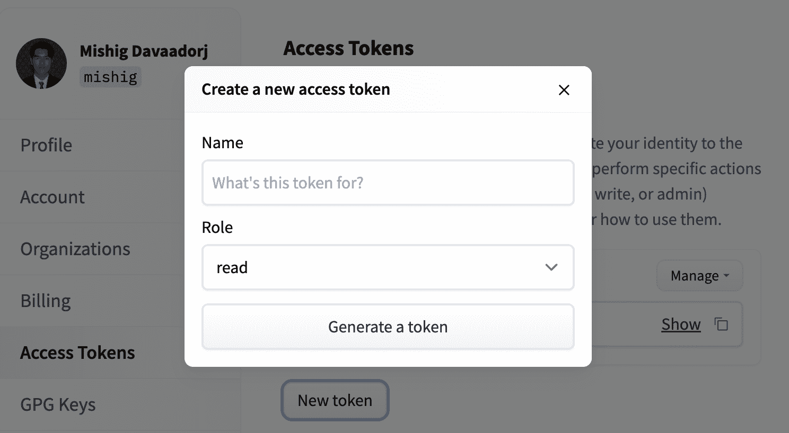
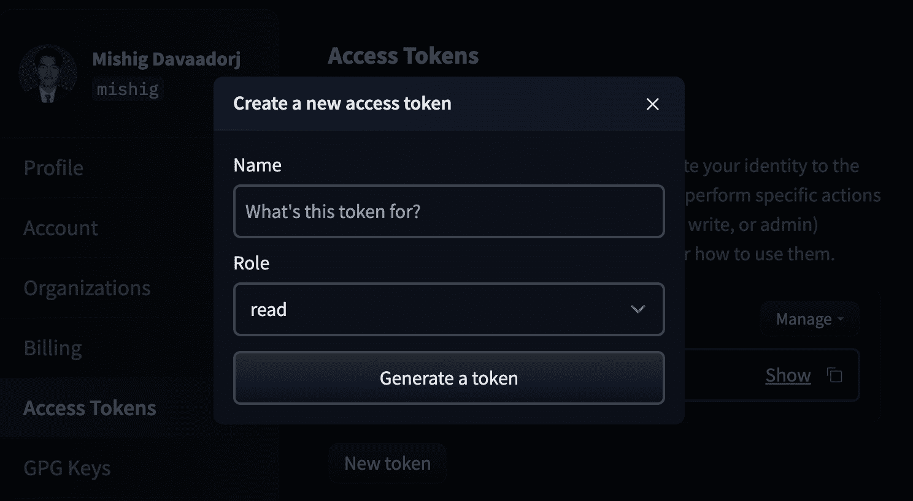

# 访问私有/受限模型

> 原始文本：[`huggingface.co/docs/transformers.js/guides/private`](https://huggingface.co/docs/transformers.js/guides/private)

由于存在泄露访问令牌给您的网站或 Web 应用程序用户的可能性，我们仅支持从具有对进程环境变量访问权限的服务器端环境（例如 Node.js）访问私有/受限模型。

## 第一步：生成用户访问令牌

[用户访问令牌](https://huggingface.co/docs/hub/security-tokens) 是验证应用程序访问 Hugging Face 服务的首选方式。

要生成访问令牌，请转到您的设置中的[访问令牌选项卡](https://huggingface.co/settings/tokens)，然后单击**新建令牌**按钮。为您的令牌选择一个名称，然后单击**生成令牌**（我们建议将“角色”保持为只读）。然后，您可以单击您新创建的令牌旁边的**复制**按钮将其复制到剪贴板中。

 

要删除或刷新用户访问令牌，您可以单击**管理**按钮。

## 第二步：在 Transformers.js 中使用访问令牌

当 `HF_TOKEN` 环境变量设置并对进程可见时，Transformers.js 将在向 Hugging Face Hub 发出的请求中附加一个授权头。

一种方法是在设置环境变量的情况下调用您的程序。例如，假设您有一个名为 `llama.js` 的文件，其中包含以下代码：

```py
import { AutoTokenizer } from '@xenova/transformers';

// Load tokenizer for a gated repository.
const tokenizer = await AutoTokenizer.from_pretrained('meta-llama/Llama-2-7b-hf');

// Encode text.
const text = 'Hello world!';
const encoded = tokenizer.encode(text);
console.log(encoded);
```

然后，您可以使用以下命令设置 `HF_TOKEN` 环境变量并运行文件：

```py
HF_TOKEN=hf_... node tests/llama.js
```

（请记住用您的实际访问令牌替换 `hf_...`）。

如果操作正确，您应该看到以下输出：

```py
[ 1, 15043, 3186, 29991 ]
```

或者，您可以直接在您的代码中设置环境变量：

```py
// Set access token (NB: Keep this private!)
process.env.HF_TOKEN = 'hf_...';

// ... rest of your code
```
