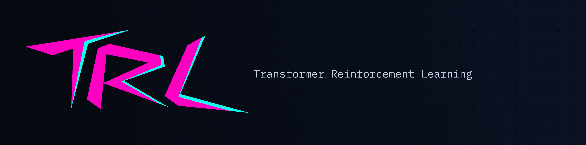
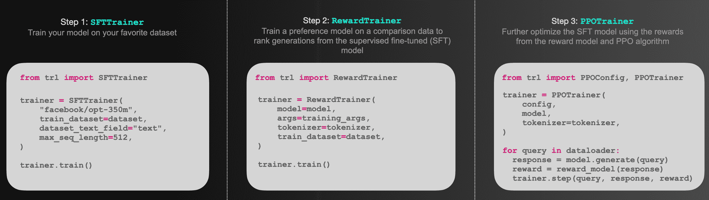

# TRL - Transformer Reinforcement Learning

> 原文：[`huggingface.co/docs/trl/index`](https://huggingface.co/docs/trl/index)

TRL 是一个全栈库，我们提供一套工具来使用强化学习训练变压器语言模型，从监督微调步骤（SFT）、奖励建模步骤（RM）到近端策略优化（PPO）步骤。该库与🤗 [transformers](https://github.com/huggingface/transformers)集成。

根据您的需求查看文档中的适当部分：

## API 文档

+   模型类: *每个公共模型类的简要概述*

+   `SFTTrainer`: *使用`SFTTrainer`轻松监督微调您的模型*

+   `RewardTrainer`: *使用`RewardTrainer`轻松训练您的奖励模型*

+   `PPOTrainer`: *使用 PPO 算法进一步微调监督微调的模型*

+   最佳 N 采样: *使用最佳 N 采样作为从活跃模型中采样预测的替代方式*

+   `DPOTrainer`: *使用`DPOTrainer`进行直接偏好优化训练*

+   `TextEnvironment`: *使用 RL 工具训练您的模型的文本环境*

## 示例

+   情感微调: *微调您的模型以生成积极的电影内容*

+   使用 PEFT 进行训练: *使用 PEFT 和适配器进行内存高效的 RLHF 训练*

+   去毒化 LLMs: *通过 RLHF 去毒化您的语言模型*

+   使用 Llama 模型: *在 Stack 交换数据集上进行端到端的 RLHF 训练*

+   使用工具进行学习: *使用`TextEnvironments`的演练*

+   多适配器训练: *使用单个基础模型和多个适配器进行内存高效的端到端训练*

## 博客文章

    
