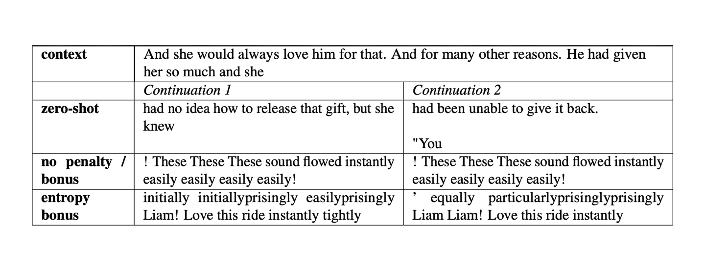

# 训练常见问题

> 原文链接：[`huggingface.co/docs/trl/how_to_train`](https://huggingface.co/docs/trl/how_to_train)

## 我应该关注哪些指标？

在执行传统的监督微调语言模型时，损失（尤其是验证损失）可以作为训练进展的良好指标。然而，在强化学习（RL）中，损失对模型性能的信息变得不太明确，其值可能会波动，而实际性能却在提高。

为了解决这个问题，我们建议首先关注两个关键指标：

**平均奖励**：主要目标是在 RL 训练期间最大化模型获得的奖励。**目标 KL 散度**：KL 散度（Kullback-Leibler 散度）衡量两个概率分布之间的不相似性。在 RL 训练的背景下，我们使用它来量化当前模型和参考模型之间的差异。理想情况下，我们希望将 KL 散度保持在 0 到 10 之间，以确保模型生成的文本保持接近参考模型生成的内容。

然而，还有更多的指标可以用于调试，请查看日志记录部分。

## 为什么我们使用参考模型，KL 散度的目的是什么？

在训练 RL 模型时，仅优化奖励可能导致意外行为，模型以不符合良好语言生成的方式利用环境。在 RLHF 的情况下，我们使用一个训练有素的奖励模型来预测生成文本是否被人类高度评价。

然而，针对奖励模型进行优化的 RL 模型可能会学习到产生高奖励的模式，但这些模式并不代表良好的语言。这可能导致极端情况，即模型生成带有过多感叹号或表情符号的文本，以最大化奖励。在一些最坏的情况下，模型可能生成与自然语言完全无关的模式，但却获得高奖励，类似于对抗性攻击。



**图表：** 没有 KL 惩罚的样本来自[`arxiv.org/pdf/1909.08593.pdf`](https://arxiv.org/pdf/1909.08593.pdf)。

为了解决这个问题，我们根据当前模型和参考模型之间的 KL 散度向奖励函数添加了一个惩罚。通过这样做，我们鼓励模型保持接近参考模型生成的内容。

## 负 KL 散度的问题是什么？

如果您纯粹从模型分布中进行抽样生成文本，通常情况下效果良好。但是当您使用`generate`方法时，由于设置不同，可能会出现一些注意事项，这可能导致 KL 散度变为负值。基本上，当活动模型实现`log_p_token_active < log_p_token_ref`时，我们会得到负 KL 散度。这可能发生在几种情况下：

+   **top-k 抽样**：模型可以平滑概率分布，导致前 k 个标记的概率小于参考模型的概率，但它们仍然被选中。

+   **min_length**：这会忽略 EOS 标记，直到达到`min_length`。因此，模型可以将 EOS 标记的对数概率设为非常低，并将所有其他标记的概率设为非常高，直到达到 min_length。

这只是一些例子。为什么负 KL 是一个问题？总奖励`R`计算为`R = r - beta * KL`，因此如果模型能够学习如何使 KL 散度为负值，它实际上会获得正奖励。在许多情况下，利用这种生成中的错误比实际学习奖励函数要容易得多。此外，KL 可以变得任意小，因此实际奖励与之相比可能非常小。

那么，您应该如何为 PPO 训练生成文本呢？让我们来看看！

## 如何为训练生成文本？

为了避免上述 KL 问题，我们建议使用以下设置：

```py
generation_kwargs = {
    "min_length": -1, # don't ignore the EOS token (see above)
    "top_k": 0.0, # no top-k sampling
    "top_p": 1.0, # no nucleus sampling
    "do_sample": True, # yes, we want to sample
    "pad_token_id": tokenizer.eos_token_id, # most decoder models don't have a padding token - use EOS token instead
    "max_new_tokens": 32, # specify how many tokens you want to generate at most
}
```

使用这些设置，通常不会遇到任何问题。您也可以尝试其他设置，但如果遇到负 KL 散度问题，请尝试返回这些设置，看看问题是否仍然存在。

## 如何调试您自己的用例？

由于 RL 管道的复杂性，调试可能具有挑战性。以下是一些提示和建议，以使这个过程更容易：

+   **从一个有效的示例开始**：从 trl 存储库中的有效示例开始，并逐渐修改以适应您的特定用例。一次性更改所有内容可能会使识别潜在问题的来源变得困难。例如，您可以从示例中替换模型开始，一旦找到最佳超参数，尝试切换到您的数据集和奖励模型。如果一次性更改所有内容，您将不知道潜在问题的来源。

+   **从小开始，后续扩展**：训练大型模型可能非常缓慢，需要几个小时或几天才能看到任何改进。对于调试来说，这不是一个方便的时间尺度，因此在开发阶段尝试使用小型模型变体，并在那些工作后扩展。也就是说，有时您必须小心，因为小型模型可能没有能力解决复杂的任务。

+   **从简单开始**：尝试从一个最简单的例子开始，然后逐渐增加复杂性。例如，您的用例可能需要一个由许多不同奖励组成的复杂奖励函数 - 首先尝试使用一个信号，看看是否可以优化，然后再增加更多复杂性。

+   **检查生成物**：检查模型生成的内容总是一个好主意。也许您的后处理或提示中有错误。由于设置不当，您可能会过早地截断生成物。这些问题在指标上很难看到，但如果您查看生成物，就会很明显。

+   **检查奖励模型**：如果您的奖励随时间不断改善，也许奖励模型存在问题。您可以查看极端情况，看看它是否按照预期运行：例如，在情感案例中，您可以检查简单的正面和负面示例是否真的获得不同的奖励。您还可以查看数据集的分布。最后，也许奖励主要由模型无法影响的查询主导，因此您可能需要对此进行归一化（例如，查询+响应的奖励减去查询的奖励）。

这些只是我们发现有用的一些提示 - 如果您有更多有用的技巧，请随时打开 PR 添加它们！
