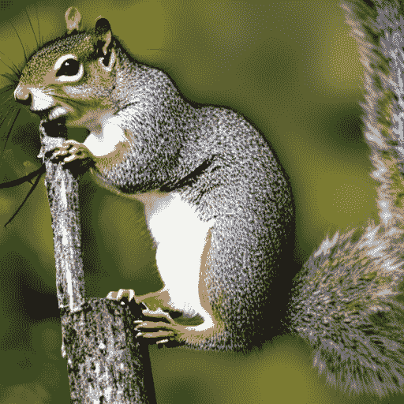
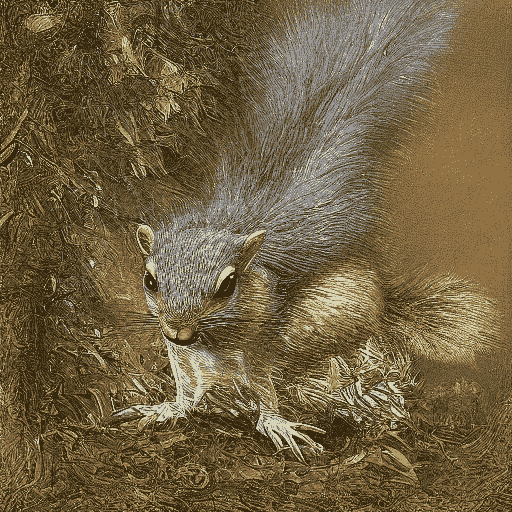
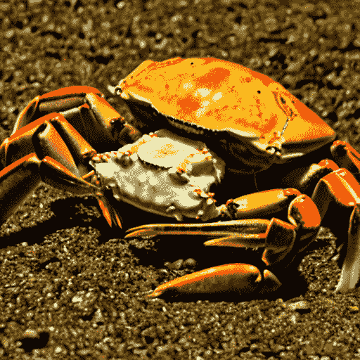
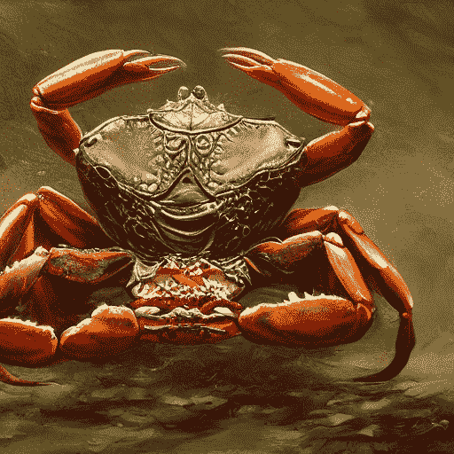
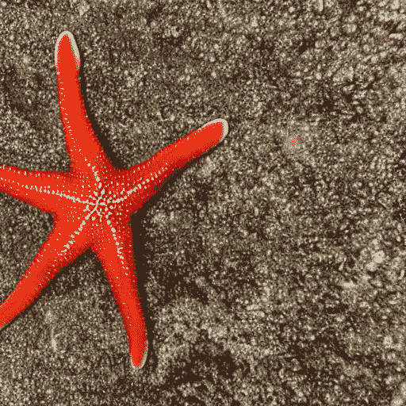
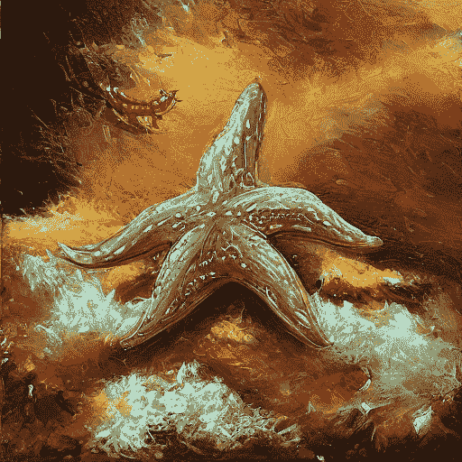

# 去噪扩散策略优化

> 原始文本：[`huggingface.co/docs/trl/ddpo_trainer`](https://huggingface.co/docs/trl/ddpo_trainer)

## 为什么

| 之前 | DDPO 微调后 |
| --- | --- |
|  |  |
|  |  |
|  |  |

## 开始使用稳定扩散微调与强化学习

使用强化学习对稳定扩散模型进行微调的机制大量使用了 HuggingFace 的`diffusers`库。提出这一点的原因是，入门需要对`diffusers`库的概念有一定的了解，主要是两个概念-流水线和调度器。直接使用（`diffusers`库），没有适用于强化学习微调的`Pipeline`或`Scheduler`实例。需要进行一些调整。

此库提供了一个流水线接口，必须实现该接口才能与`DDPOTrainer`一起使用，后者是用于使用强化学习微调稳定扩散的主要机制。**注意：目前仅支持 StableDiffusion 架构。**有一个默认实现的接口，您可以直接使用。假设默认实现足够好和/或为了让事情顺利进行，请参考本指南旁边的训练示例。

接口的目的是将流水线和调度器融合为一个对象，从而在一个地方实现最小化约束。该接口的设计是希望能够满足此存储库中以及其他地方的流水线和调度器的需求。此外，调度器步骤是此流水线接口的一种方法，鉴于原始调度器可通过接口访问，这可能看起来有些多余，但这是约束调度器步骤输出为适合手头算法（DDPO）的输出类型的唯一方法。

有关接口和相关默认实现的更详细信息，请访问[此处](https://github.com/lvwerra/trl/tree/main/trl/models/modeling_sd_base.py)

请注意，默认实现具有基于 LoRA 的实现路径和非 LoRA 的实现路径。默认情况下启用 LoRA 标志，可以通过传递标志来关闭。基于 LORA 的训练速度更快，负责模型收敛的 LORA 相关模型超参数不像非 LORA 的训练那样挑剔。

此外，还期望提供奖励函数和提示函数。奖励函数用于评估生成的图像，提示函数用于生成用于生成图像的提示。

## 开始使用示例/脚本/ddpo.py

`ddpo.py`脚本是使用`DDPO`训练器对稳定扩散模型进行微调的工作示例。此示例明确配置了与配置对象（`DDPOConfig`）相关的整体参数的一个小子集。

注意：建议使用一个 A100 GPU 来运行此程序。任何低于 A100 的 GPU 都无法运行此示例脚本，即使通过相对较小的参数运行，结果很可能会很差。

几乎每个配置参数都有一个默认值。用户只需要一个命令行标志参数即可使事情运转起来。用户需要拥有一个[huggingface 用户访问令牌](https://huggingface.co/docs/hub/security-tokens)，该令牌将用于在微调后将模型上传到 HuggingFace hub。需要输入以下 bash 命令来使事情运转起来

```py
python ddpo.py --hf_user_access_token <token>
```

要获取`stable_diffusion_tuning.py`的文档，请运行`python stable_diffusion_tuning.py --help`

以下是在配置训练器时要记住的事项（代码也会为您检查），除了使用示例脚本的用例之外

+   可配置的样本批量大小（`--ddpo_config.sample_batch_size=6`）应大于或等于可配置的训练批量大小（`--ddpo_config.train_batch_size=3`）

+   可配置的样本批量大小（`--ddpo_config.sample_batch_size=6`）必须能被可配置的训练批量大小（`--ddpo_config.train_batch_size=3`）整除

+   可配置的样本批量大小（`--ddpo_config.sample_batch_size=6`）必须能被可配置的梯度累积步数（`--ddpo_config.train_gradient_accumulation_steps=1`）和可配置的加速器进程计数整除

## 设置图像记录挂钩函数

期望函数接收一个形式为列表的列表

```py
[[image, prompt, prompt_metadata, rewards, reward_metadata], ...]

```

和`image`、`prompt`、`prompt_metadata`、`rewards`、`reward_metadata`是批量处理的。列表中的最后一个列表代表最后的样本批次。您可能想要记录这个。虽然您可以自由记录，但建议使用`wandb`或`tensorboard`。

### 关键术语

+   `rewards`：奖励/分数是与生成的图像相关联的数字，是引导 RL 过程的关键

+   `reward_metadata`：奖励元数据是与奖励相关联的元数据。将其视为随着奖励一起传递的额外信息负载

+   `prompt`：提示是用于生成图像的文本

+   `prompt_metadata`：提示元数据是与提示相关联的元数据。当奖励模型包含一个[`FLAVA`](https://huggingface.co/docs/transformers/model_doc/flava)设置时，预期的问题和地面答案（与生成的图像相关联）将与生成的图像一起出现（请参阅这里：[`github.com/kvablack/ddpo-pytorch/blob/main/ddpo_pytorch/rewards.py#L45`](https://github.com/kvablack/ddpo-pytorch/blob/main/ddpo_pytorch/rewards.py#L45)）

+   `image`：由稳定扩散模型生成的图像

以下是使用`wandb`记录采样图像的示例代码。

```py
# for logging these images to wandb

def image_outputs_hook(image_data, global_step, accelerate_logger):
    # For the sake of this example, we only care about the last batch
    # hence we extract the last element of the list
    result = {}
    images, prompts, _, rewards, _ = image_data[-1]
    for i, image in enumerate(images):
        pil = Image.fromarray(
            (image.cpu().numpy().transpose(1, 2, 0) * 255).astype(np.uint8)
        )
        pil = pil.resize((256, 256))
        result[f"{prompts[i]:.25} | {rewards[i]:.2f}"] = [pil]
    accelerate_logger.log_images(
        result,
        step=global_step,
    )

```

### 使用微调模型

假设您已经完成了所有的时代，并且已经将您的模型推送到了 hub，您可以按如下方式使用微调模型

```py

import torch
from trl import DefaultDDPOStableDiffusionPipeline

pipeline = DefaultDDPOStableDiffusionPipeline("metric-space/ddpo-finetuned-sd-model")

device = torch.device("cuda") if torch.cuda.is_available() else torch.device("cpu")

# memory optimization
pipeline.vae.to(device, torch.float16)
pipeline.text_encoder.to(device, torch.float16)
pipeline.unet.to(device, torch.float16)

prompts = ["squirrel", "crab", "starfish", "whale","sponge", "plankton"]
results = pipeline(prompts)

for prompt, image in zip(prompts,results.images):
    image.save(f"{prompt}.png")

```

## 积分

这项工作受到了仓库[这里](https://github.com/kvablack/ddpo-pytorch)和相关论文[使用强化学习训练扩散模型，作者为 Kevin Black, Michael Janner, Yilan Du, Ilya Kostrikov, Sergey Levine](https://arxiv.org/abs/2305.13301)的重大影响。
