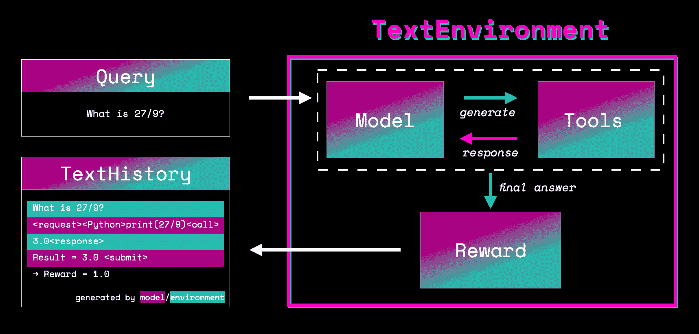
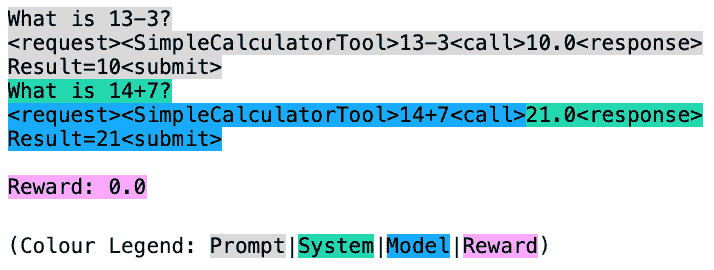

# 文本环境

> 原文链接：[`huggingface.co/docs/trl/text_environments`](https://huggingface.co/docs/trl/text_environments)

文本环境为语言代理提供了一个学习场所。它允许语言模型使用工具来完成任务，比如使用 Python 解释器回答数学问题或使用搜索索引回答问答问题。有了工具的访问权限，语言模型可以解决对模型本身来说非常困难但对适当工具来说却很简单的任务。一个很好的例子是大数字的算术，在你有了计算器的访问权限后，它变成了一个简单的复制粘贴任务。



让我们深入了解文本环境的工作，并从工具开始！

## 工具

文本环境的核心构建块之一是模型可以使用的工具，以解决任务。一般来说，工具可以是任何以字符串作为输入并返回字符串的 Python 函数。`TextEnvironment`为工具提供了两个选项：要么使用`transformers.Tool`中预定义的工具，要么定义自己的函数或类，具有`__call__`方法。让我们一起看看两者！

### transformers.Tool

文本环境完全支持`transformers.Tool`类的工具。在该框架中构建工具的优势在于它们可以轻松共享

```py
from transformers import load_tool

# simple calculator tool that runs +-/* operations
calc_tool = load_tool("ybelkada/simple-calculator")

# python interpreter that executes program and returns outputs
py_tool = load_tool("lvwerra/python-interpreter")

# wikipedia search index that returns best search match
wiki_tool = load_tool("vwxyzjn/pyserini-wikipedia-kilt-doc")
```

这些工具可以从 hub 加载，也可以从本地文件夹加载。使用工具就像简单地用文本查询调用它们一样：

```py
calc_tool("1/2")
>>> "0.5"
```

请注意，输入和返回值都是字符串，以便与语言模型轻松使用。 

### 自定义工具

以下是一个将两个整数相加的工具示例：

```py
def add(text):
    int_1, int_2 = text.split("+")
    result = int(int_1) + int(int_2)
    return str(result)

print(add("1+1"))
>>> "2"
```

我们已经看过了基本示例，比如计算器，但这个原则也适用于更复杂的工具，比如一个网络搜索工具，你输入查询，然后得到搜索结果。现在让我们看看模型如何使用调用语法来使用工具。

### 调用语法

为了让模型以统一的方式调用工具，我们创建了一个简单的语法，如下所示：

```py
"<request><TOOL_NAME>QUERY<call>TOOL_RESPONSE<response>"
```

涉及一些特殊标记，让我们来分解一下：首先，模型可以通过发出`<request>`标记来表示它想要使用一个工具。之后，我们想知道要调用的工具的名称，这通过用`<>`括起工具名称来完成。一旦知道要调用哪个工具，工具查询就会跟随，以自由文本形式呈现。`<call>`标记表示查询的结束，停止模型生成。在这一点上，模型输出被解析，并将查询发送给工具。环境将工具响应附加到字符串后面，接着是`<response>`标记，表示工具输出的结束。

让我们来看一个具体的例子，假设计算器的名字是`Calculator`（关于如何推断工具名称的更多信息）：

```py
"<request><Calculator>1/2<call>0.5<response>"
```

最后，当模型生成`<submit>`时，表示交互已完成，剧集结束并停止生成。

现在让我们看看如何创建一个新的文本环境！

## 创建一个 TextEnvironment

```py
prompt = """\
What is 13-3?
<request><SimpleCalculatorTool>13-3<call>10.0<response>
Result=10<submit>
"""

def reward_fn(result, answer):
    """Simplified reward function returning 1 if result matches answer and 0 otherwise."""
    result_parsed = result.split("=")[1].split("<")[0]
    return int(result_parsed==answer)

text_env = TextEnvironemnt(
    model=model, 
    tokenizer=tokenizer,
    tools= {"SimpleCalculatorTool": load_tool("ybelkada/simple-calculator")},
    reward_fn=exact_match_reward,
    prompt=prompt, 
    max_turns=1
    max_tool_response=100
    generation_kwargs={"do_sample": "true"}
)
```

让我们来分解这些设置：

| 参数 | 描述 |
| :-- | :-- |
| `model` | 与环境交互并生成请求的语言模型。 |
| `tokenizer` | 处理字符串标记化的语言模型分词器。 |
| `tools` | 工具的`dict`列表。如果是前者，工具的名称将从类名中推断，否则就是字典的键。 |
| `reward_fn` | 以字符串作为输入并返回的函数。可以有额外的参数传递给`.run()`，如真实值。 |
| `prompt` | 添加到每个任务前的提示。通常是一些示例，向模型演示如何以 few-shot 方式使用工具。 |
| `max_turns` | 模型和工具之间的最大交互次数，直到结束。 |
| `max_tool_response` | 工具响应被截断到这个数字，以避免模型上下文用尽。 |
| `max_length` | 允许在一个剧集中的最大标记数。 |
| `generation_kwargs` | 语言模型使用的生成设置。 |

您可以根据自己的需求自定义环境并添加自定义工具和设置。让我们看看如何使用环境让模型与可用工具进行交互！

## 运行一个剧集

要通过文本环境运行一组查询，可以简单地使用`run`方法。

```py
queries = ["What is 1/2?"]
answers = ["0.5"]

queries, responses, masks, rewards, histories = text_env.run(queries, answers=answers)
```

这将为每个查询执行模型/工具反馈循环，直到不再调用工具，达到最大轮次或超过剧集中的最大标记数。传递给`run`的额外`kwargs`（例如上面的`answers=answers`）将传递给奖励函数。

`run`返回五个对象：

+   `queries`：一个标记化查询的列表

+   `responses`：在环境中生成的所有标记，包括模型和工具标记

+   `masks`：指示哪些标记由模型生成，哪些标记由工具生成的掩码

+   `rewards`：每个查询/响应的奖励列表

+   `histories`：`TextHistory`对象的列表，这些对象包含上述所有内容以及文本等效内容

掩码对于训练至关重要，因为我们不希望优化模型未生成的标记，这些标记是工具生成的标记。

接下来，我们将用生成的响应训练一个 PPO 步骤！

### 训练

从`TextEnvironment`中的剧集训练是直接的，只需要将所有返回的变量转发到`step`方法，除了`TextHistory`对象：

```py
train_stats = ppo_trainer.step(queries, responses, rewards, masks)
```

## TextHistory

`TextHistory`对象存储了模型与文本环境之间的交互。它存储了每个轮次中生成的标记和文本以及它们的来源（模型或系统）以及奖励。让我们来看看类的属性和方法。

### 属性

以下表总结了`TextEnvironment`类的可用属性：

| 属性 | 描述 |
| :-- | :-- |
| `text` | 在文本环境中生成的完整文本字符串，包括模型和系统生成的文本。 |
| `text_spans` | 一个包含每个模型或系统生成文本段的范围的元组列表。 |
| `system_spans` | 一个包含指示段是模型还是系统生成的布尔值列表。 |
| `tokens` | 在文本环境中生成的所有标记，包括模型和系统生成的标记。 |
| `token_spans` | 与`text_spans`类似，`token_spans`指示模型和系统生成的标记的边界。 |
| `token_masks` | 标记掩码可用于通过屏蔽它们来忽略系统生成的标记。 |
| `completed` | 表示与环境的交互是否已完成。 |
| `truncated` | 表示与环境的交互是否已完成，因为已达到最大长度。 |

有了这些属性，您可以重建模型与`TextEnvironment`的每次交互。`TextHistory`还可以让您可视化文本历史。让我们来看看！

### 可视化

当模型在`TextEnvironment`内进行交互时，将文本输出的哪些部分是由模型生成的，哪些部分来自系统和工具，可以是有用的。为此，有两种方法 TextHistory.show_text()和 TextHistory.show_tokens()。它们分别打印文本和标记，并使用[`rich`库](https://github.com/Textualize/rich)突出显示各个段（在使用这些方法之前，请确保安装它）。

您可以看到提示以灰色突出显示，而查询和工具响应等系统段以绿色突出显示。模型生成的所有段都以蓝色突出显示，除了纯文本输出外，奖励也显示为李子色的附加文本。这里是`show_text`的一个示例：



有时在显示解码文本时可能会隐藏一些与标记化相关的棘手问题。因此，`TextHistory`还提供了一个选项，可以直接在标记上显示相同的高亮显示，方法是使用`show_tokens`：


请注意，您可以通过传递`show_legend=True`来打开颜色图例。

## API 文档

### `class trl.TextEnvironment`

[<来源>](https://github.com/huggingface/trl/blob/v0.7.10/trl/environment/base_environment.py#L208)

```py
( model = None tokenizer = None tools = None reward_fn = None prompt = None max_turns = 4 max_tool_reponse = 100 max_length = None generation_kwargs = None )
```

TextEnvironment 使 LLM 与环境之间使用工具进行交互成为可能。

#### `compute_reward`

[<来源>](https://github.com/huggingface/trl/blob/v0.7.10/trl/environment/base_environment.py#L358)

```py
( histories **reward_kwargs )
```

计算一组历史记录的奖励。

#### `generate`

[<来源>](https://github.com/huggingface/trl/blob/v0.7.10/trl/environment/base_environment.py#L367)

```py
( histories )
```

为历史列表生成响应。

#### `parse_tool_call`

[<来源>](https://github.com/huggingface/trl/blob/v0.7.10/trl/environment/base_environment.py#L333)

```py
( text )
```

解析请求字符串。预期格式：<请求><工具名称>查询<调用>

#### `run`

[<来源>](https://github.com/huggingface/trl/blob/v0.7.10/trl/environment/base_environment.py#L263)

```py
( queries **rewards_kwargs )
```

参数

+   `queries`（字符串列表）— 要在环境中运行模型的查询列表。

在一组查询上运行环境。

#### `step`

[<来源>](https://github.com/huggingface/trl/blob/v0.7.10/trl/environment/base_environment.py#L296)

```py
( history )
```

参数

+   `history`（`TextHistory`）— 要向前迈出一步的历史。

将环境向前推进一轮。

#### `task_end_check`

[<来源>](https://github.com/huggingface/trl/blob/v0.7.10/trl/environment/base_environment.py#L393)

```py
( history model_turn = True )
```

检查当前生成序列是否已完成。

#### `tasks_end_check`

[<来源>](https://github.com/huggingface/trl/blob/v0.7.10/trl/environment/base_environment.py#L382)

```py
( histories model_turn = True )
```

检查当前生成序列是否已完成。

### `class trl.TextHistory`

[<来源>](https://github.com/huggingface/trl/blob/v0.7.10/trl/environment/base_environment.py#L59)

```py
( text tokens system = True )
```

TextHistory 类跟踪语言模型与环境之间交互的历史。

#### `append_segment`

[<来源>](https://github.com/huggingface/trl/blob/v0.7.10/trl/environment/base_environment.py#L88)

```py
( text tokens system = True )
```

将新段落附加到历史记录中。

参数：text（`str`）：新段落的文本。tokens（`torch.LongTensor`）：新段落的标记。system（`bool`，*可选*）：新段落是否为系统或用户段。

#### `complete`

[<来源>](https://github.com/huggingface/trl/blob/v0.7.10/trl/environment/base_environment.py#L116)

```py
( truncated = False )
```

将历史标记为已完成。

#### `show_colour_legend`

[<来源>](https://github.com/huggingface/trl/blob/v0.7.10/trl/environment/base_environment.py#L189)

```py
( )
```

打印颜色图例。

#### `show_text`

[<来源>](https://github.com/huggingface/trl/blob/v0.7.10/trl/environment/base_environment.py#L142)

```py
( show_legend = False )
```

打印文本历史。

#### `show_tokens`

[<来源>](https://github.com/huggingface/trl/blob/v0.7.10/trl/environment/base_environment.py#L164)

```py
( tokenizer show_legend = False )
```

打印历史标记。

#### `split_query_response_tokens`

[<来源>](https://github.com/huggingface/trl/blob/v0.7.10/trl/environment/base_environment.py#L131)

```py
( )
```

将标记分为查询和响应标记。
