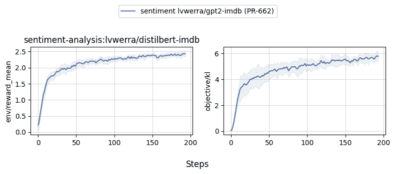
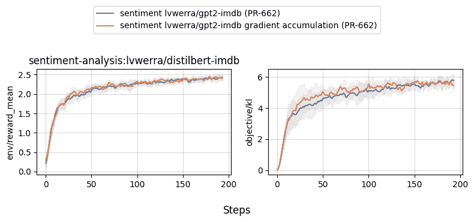
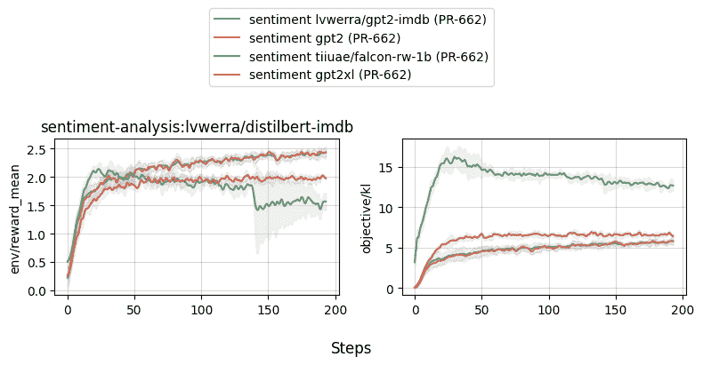
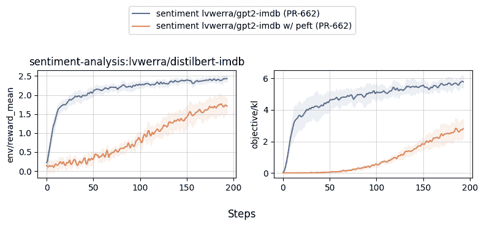

# 情感微调示例

> 原始文本：[`huggingface.co/docs/trl/sentiment_tuning`](https://huggingface.co/docs/trl/sentiment_tuning)

这些示例中的笔记本和脚本展示了如何使用情感分类器（例如`lvwerra/distilbert-imdb`）微调模型。

以下是[trl 存储库](https://github.com/huggingface/trl/tree/main/examples)中的笔记本和脚本概述：

| 文件 | 描述 |
| --- | --- |
| [`examples/scripts/ppo.py`](https://github.com/huggingface/trl/blob/main/examples/scripts/ppo.py)  | 该脚本展示了如何使用`PPOTrainer`微调情感分析模型使用 IMDB 数据集。 |
| [`examples/notebooks/gpt2-sentiment.ipynb`](https://github.com/huggingface/trl/tree/main/examples/notebooks/gpt2-sentiment.ipynb) | 本笔记本演示了如何在 jupyter 笔记本上重现 GPT2 imdb 情感微调示例。 |
| [`examples/notebooks/gpt2-control.ipynb`](https://github.com/huggingface/trl/tree/main/examples/notebooks/gpt2-control.ipynb)  | 本笔记本演示了如何在 jupyter 笔记本上重现 GPT2 情感控制示例。 |

## 用法

```py
# 1\. run directly
python examples/scripts/ppo.py
# 2\. run via `accelerate` (recommended), enabling more features (e.g., multiple GPUs, deepspeed)
accelerate config # will prompt you to define the training configuration
accelerate launch examples/scripts/ppo.py # launches training
# 3\. get help text and documentation
python examples/scripts/ppo.py --help
# 4\. configure logging with wandb and, say, mini_batch_size=1 and gradient_accumulation_steps=16
python examples/scripts/ppo.py --ppo_config.log_with wandb --ppo_config.mini_batch_size 1 --ppo_config.gradient_accumulation_steps 16
```

注意：如果不想使用`wandb`进行日志记录，请在脚本/笔记本中删除`log_with="wandb"`。您也可以将其替换为您喜欢的实验跟踪器，该跟踪器由`accelerate`支持。

## 关于多 GPU 的一些注意事项

要在多 GPU 设置中使用 DDP（分布式数据并行），请将`device_map`值更改为`device_map={"": Accelerator().process_index}`，并确保使用`accelerate launch yourscript.py`运行脚本。如果要应用简单的管道并行性，可以使用`device_map="auto"`。

## 基准测试

以下是`examples/scripts/ppo.py`的一些基准结果。要在本地重现，请查看下面的`--command`参数。

```py
python benchmark/benchmark.py \
    --command "python examples/scripts/ppo.py --ppo_config.log_with wandb" \
    --num-seeds 5 \
    --start-seed 1 \
    --workers 10 \
    --slurm-nodes 1 \
    --slurm-gpus-per-task 1 \
    --slurm-ntasks 1 \
    --slurm-total-cpus 12 \
    --slurm-template-path benchmark/trl.slurm_template
```



## 使用和不使用梯度累积

```py
python benchmark/benchmark.py \
    --command "python examples/scripts/ppo.py --ppo_config.exp_name sentiment_tuning_step_grad_accu --ppo_config.mini_batch_size 1 --ppo_config.gradient_accumulation_steps 128 --ppo_config.log_with wandb" \
    --num-seeds 5 \
    --start-seed 1 \
    --workers 10 \
    --slurm-nodes 1 \
    --slurm-gpus-per-task 1 \
    --slurm-ntasks 1 \
    --slurm-total-cpus 12 \
    --slurm-template-path benchmark/trl.slurm_template
```



## 比较不同模型（gpt2、gpt2-xl、falcon、llama2）

```py
python benchmark/benchmark.py \
    --command "python examples/scripts/ppo.py --ppo_config.exp_name sentiment_tuning_gpt2 --ppo_config.log_with wandb" \
    --num-seeds 5 \
    --start-seed 1 \
    --workers 10 \
    --slurm-nodes 1 \
    --slurm-gpus-per-task 1 \
    --slurm-ntasks 1 \
    --slurm-total-cpus 12 \
    --slurm-template-path benchmark/trl.slurm_template
python benchmark/benchmark.py \
    --command "python examples/scripts/ppo.py --ppo_config.exp_name sentiment_tuning_gpt2xl_grad_accu --ppo_config.model_name gpt2-xl --ppo_config.mini_batch_size 16 --ppo_config.gradient_accumulation_steps 8 --ppo_config.log_with wandb" \
    --num-seeds 5 \
    --start-seed 1 \
    --workers 10 \
    --slurm-nodes 1 \
    --slurm-gpus-per-task 1 \
    --slurm-ntasks 1 \
    --slurm-total-cpus 12 \
    --slurm-template-path benchmark/trl.slurm_template
python benchmark/benchmark.py \
    --command "python examples/scripts/ppo.py --ppo_config.exp_name sentiment_tuning_falcon_rw_1b --ppo_config.model_name tiiuae/falcon-rw-1b --ppo_config.log_with wandb" \
    --num-seeds 5 \
    --start-seed 1 \
    --workers 10 \
    --slurm-nodes 1 \
    --slurm-gpus-per-task 1 \
    --slurm-ntasks 1 \
    --slurm-total-cpus 12 \
    --slurm-template-path benchmark/trl.slurm_template
```



## 使用和不使用 PEFT

```py
python benchmark/benchmark.py \
    --command "python examples/scripts/ppo.py --ppo_config.exp_name sentiment_tuning_peft --use_peft --ppo_config.log_with wandb" \
    --num-seeds 5 \
    --start-seed 1 \
    --workers 10 \
    --slurm-nodes 1 \
    --slurm-gpus-per-task 1 \
    --slurm-ntasks 1 \
    --slurm-total-cpus 12 \
    --slurm-template-path benchmark/trl.slurm_template
```


