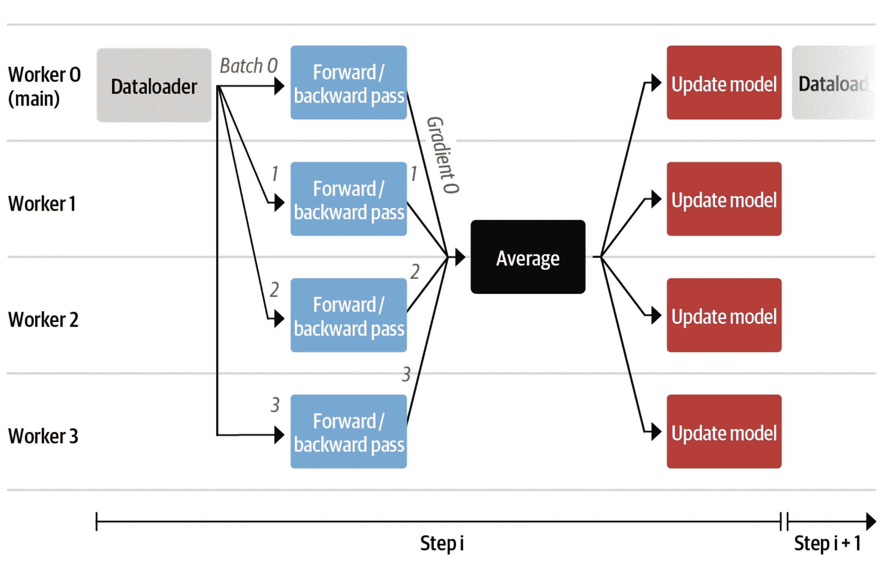
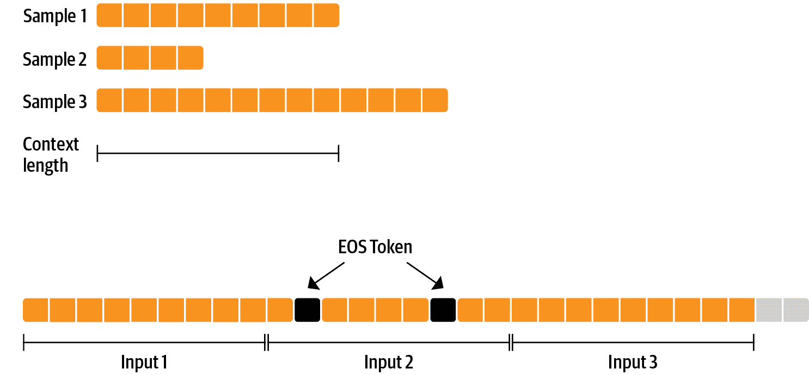

# 使用 LLaMA 模型与 TRL

> 原始文本：[`huggingface.co/docs/trl/using_llama_models`](https://huggingface.co/docs/trl/using_llama_models)

我们已经开始推出示例，以在`trl`中使用 Meta 的 LLaMA 模型（请参阅[Meta 的 LLaMA 发布](https://ai.facebook.com/blog/large-language-model-llama-meta-ai/)以获取原始 LLaMA 模型）。

## 高效的训练策略

即使训练最小的 LLaMA 模型也需要大量内存。一些快速的数学计算：在 bf16 中，每个参数使用 2 个字节（在 fp32 中为 4 个字节），另外还使用 8 个字节，例如在 Adam 优化器中使用的（有关更多信息，请参阅 Transformers 中的[性能文档](https://huggingface.co/docs/transformers/perf_train_gpu_one#optimizer)）。因此，一个 7B 参数模型将使用`(2+8)*7B=70GB`才能完全适应内存，并且在计算注意力分数等中可能需要更多。因此，即使在单个 80GB 的 A100 上也无法训练模型。您可以使用一些技巧，例如更高效的优化器或半精度训练，将更多内容压缩到内存中，但迟早会用完。

另一个选择是使用参数高效微调（PEFT）技术，例如[`peft`](https://github.com/huggingface/peft)库，它可以在加载为 8 位的模型上执行低秩适应（LoRA）。有关`peft` + `trl`的更多信息，请参阅[文档](https://huggingface.co/docs/trl/sentiment_tuning_peft)。

将模型加载为 8 位会显著减少内存占用，因为权重只需要每个参数一个字节（例如，7B LlaMa 在内存中占用 7GB）。LoRA 不是直接训练原始权重，而是在某些特定层（通常是注意力层）的顶部添加小的适配器层，从而大大减少可训练参数的数量。

在这种情况下，一个经验法则是为每十亿参数分配约 1.2-1.4GB 的内存（取决于批处理大小和序列长度），以适应整个微调设置。这可以以较低的成本实现对更大模型的微调（在 NVIDIA A100 80GB 上可达 50-60B 规模的模型）。

现在我们可以将非常大的模型适配到单个 GPU 中，但训练可能仍然非常缓慢。在这种情况下最简单的策略是数据并行处理：我们将相同的训练设置复制到不同的 GPU 中，并将不同的批次传递给每个 GPU。通过这种方式，您可以并行化模型的前向/后向传递，并随着 GPU 数量的增加而扩展。



我们使用`transformers.Trainer`或`accelerate`，它们都支持数据并行处理，无需任何代码更改，只需在调用带有`torchrun`或`accelerate launch`的脚本时传递参数。以下分别在单台机器上使用 8 个 GPU 运行训练脚本，使用`accelerate`和`torchrun`。

```py
accelerate launch --multi_gpu --num_machines 1  --num_processes 8 my_accelerate_script.py
torchrun --nnodes 1  --nproc_per_node 8 my_torch_script.py
```

## 监督微调

在开始训练奖励模型并使用 RL 调整我们的模型之前，如果模型在我们感兴趣的领域已经很好，将会有所帮助。在我们的情况下，我们希望它能回答问题，而对于其他用例，我们可能希望它能遵循指令，这种情况下指令调整是一个很好的主意。实现这一点的最简单方法是继续使用来自该领域或任务的文本进行语言模型的训练。[StackExchange 数据集](https://huggingface.co/datasets/HuggingFaceH4/stack-exchange-preferences)非常庞大（超过 1000 万条指令），因此我们可以轻松地在其子集上训练语言模型。

在进行 RLHF 之前对模型进行微调没有什么特别的 - 我们只是应用了这里的预训练因果语言建模目标。为了有效使用数据，我们使用一种称为 packing 的技术：不是每个样本在批处理中有一个文本，然后填充到最长文本或模型的最大上下文，而是在许多文本之间使用 EOS 标记连接，并切割上下文大小的块以填充批处理而不进行任何填充。



通过这种方法，训练效率更高，因为通过模型传递的每个标记也会得到训练，而不像通常从损失中屏蔽的填充标记。如果您没有太多数据，并且更担心偶尔截断一些溢出上下文的标记，您也可以使用经典数据加载器。

`ConstantLengthDataset`处理打包，然后在使用`peft`加载模型后，我们可以使用`Trainer`。首先，我们以 int8 加载模型，为训练做准备，然后添加 LoRA 适配器。

```py
# load model in 8bit
model = AutoModelForCausalLM.from_pretrained(
        args.model_path,
        load_in_8bit=True,
        device_map={"": Accelerator().local_process_index}
    )
model = prepare_model_for_kbit_training(model)

# add LoRA to model
lora_config = LoraConfig(
    r=16,
    lora_alpha=32,
    lora_dropout=0.05,
    bias="none",
    task_type="CAUSAL_LM",
)

model = get_peft_model(model, config)
```

我们使用因果语言建模目标对模型进行几千步的训练，并保存模型。由于我们将再次使用不同目标调整模型，我们将适配器权重与原始模型权重合并。

**免责声明：**由于 LLaMA 的许可证，我们仅在以下部分发布适配器权重和模型检查点。您可以通过填写 Meta AI 的[表格](https://docs.google.com/forms/d/e/1FAIpQLSfqNECQnMkycAp2jP4Z9TFX0cGR4uf7b_fBxjY_OjhJILlKGA/viewform)申请访问基础模型的权重，然后通过运行此[脚本](https://github.com/huggingface/transformers/blob/main/src/transformers/models/llama/convert_llama_weights_to_hf.py)将其转换为🤗 Transformers 格式。请注意，您还需要安装🤗 Transformers 源代码，直到`v4.28`发布为止。

现在我们已经为任务对模型进行了微调，我们准备训练一个奖励模型。

## 奖励建模和人类偏好

原则上，我们可以直接使用人类注释对模型进行 RLHF 微调。然而，这将要求我们在每次优化迭代后向人类发送一些样本进行评分。由于需要收敛的训练样本数量以及人类阅读和注释者速度的固有延迟，这是昂贵且缓慢的。

一个很好的技巧是在 RL 循环之前收集人类注释并训练一个奖励模型，而不是直接反馈。奖励模型的目标是模仿人类如何评价文本。构建奖励模型有几种可能的策略：最直接的方式是预测注释（例如评分或“好”/“坏”的二进制值）。实际上，更好的做法是预测两个示例的排名，其中奖励模型呈现给定提示`x`的两个候选人`(y_k, y_j)`，并且必须预测哪一个会被人类注释者评为更高。

通过 StackExchange 数据集，我们可以根据分数推断用户更喜欢两个答案中的哪一个。有了这些信息和上面定义的损失，我们可以通过添加自定义损失函数修改`transformers.Trainer`。

```py
class RewardTrainer(Trainer):
    def compute_loss(self, model, inputs, return_outputs=False):
        rewards_j = model(input_ids=inputs["input_ids_j"],  attention_mask=inputs["attention_mask_j"])[0]
        rewards_k = model(input_ids=inputs["input_ids_k"], attention_mask=inputs["attention_mask_k"])[0]
        loss = -nn.functional.logsigmoid(rewards_j - rewards_k).mean()
        if return_outputs:
            return loss, {"rewards_j": rewards_j, "rewards_k": rewards_k}
        return loss
```

我们利用了 100,000 对候选人的子集，并在一个包含 50,000 个样本的保留集上进行评估。使用较小的训练批次大小为 4，我们使用 LoRA `peft`适配器在 Adam 优化器和 BF16 精度下对 Llama 模型进行单个时代的训练。我们的 LoRA 配置是：

```py
peft_config = LoraConfig(
    task_type=TaskType.SEQ_CLS,
    inference_mode=False,
    r=8,
    lora_alpha=32,
    lora_dropout=0.1,
)
```

如下一节详细介绍的那样，生成的适配器可以合并到冻结模型中并保存以供进一步下游使用。

## 从人类反馈中进行强化学习

有了经过微调的语言模型和奖励模型，我们现在准备运行 RL 循环。大致分为三个步骤：

1.  从提示生成响应，

1.  使用奖励模型对响应进行评分，

1.  使用评级运行强化学习策略优化步骤。

在将 Query 和 Response 提示标记化并传递给模型之前，这些提示的模板如下：

```py
Question: <Query>

Answer: <Response>
```

SFT、RM 和 RLHF 阶段都使用了相同的模板。再次，我们利用`peft`进行内存高效训练，在 RLHF 环境中提供了额外的优势。在这里，参考模型和策略共享相同的基础，即 SFT 模型，在训练过程中以 8 位加载并冻结。我们专门使用 PPO 优化策略的 LoRA 权重，同时共享基础模型的权重。

```py
for epoch, batch in tqdm(enumerate(ppo_trainer.dataloader)):
    question_tensors = batch["input_ids"]

	# sample from the policy and to generate responses
    response_tensors = ppo_trainer.generate(
        question_tensors,
        return_prompt=False,
        length_sampler=output_length_sampler,
        **generation_kwargs,
    )
    batch["response"] = tokenizer.batch_decode(response_tensors, skip_special_tokens=True)

    # Compute sentiment score
    texts = [q + r for q, r in zip(batch["query"], batch["response"])]
    pipe_outputs = sentiment_pipe(texts, **sent_kwargs)
    rewards = [torch.tensor(output[0]["score"] - script_args.reward_baseline) for output in pipe_outputs]

    # Run PPO step
    stats = ppo_trainer.step(question_tensors, response_tensors, rewards)
	# Log stats to Wandb
    ppo_trainer.log_stats(stats, batch, rewards)
```

有关其余细节和评估，请参考我们在 StackLLaMA 上的博客帖子。
