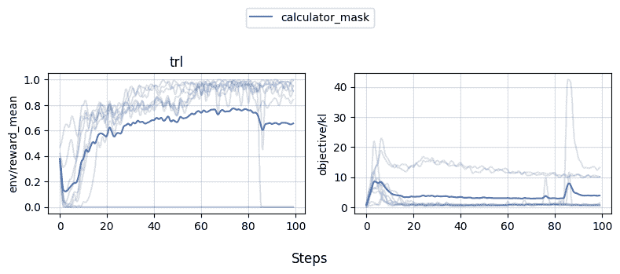
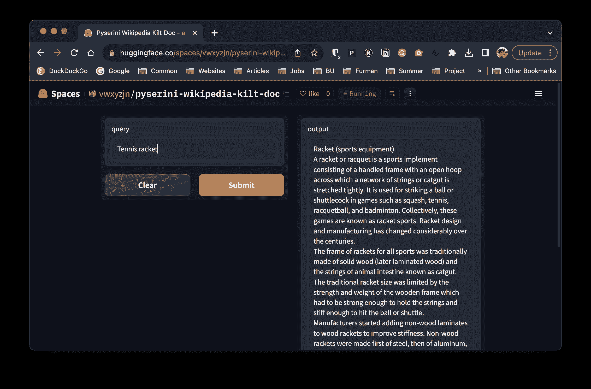
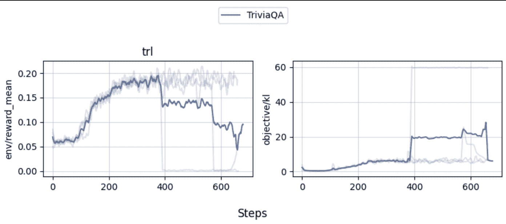
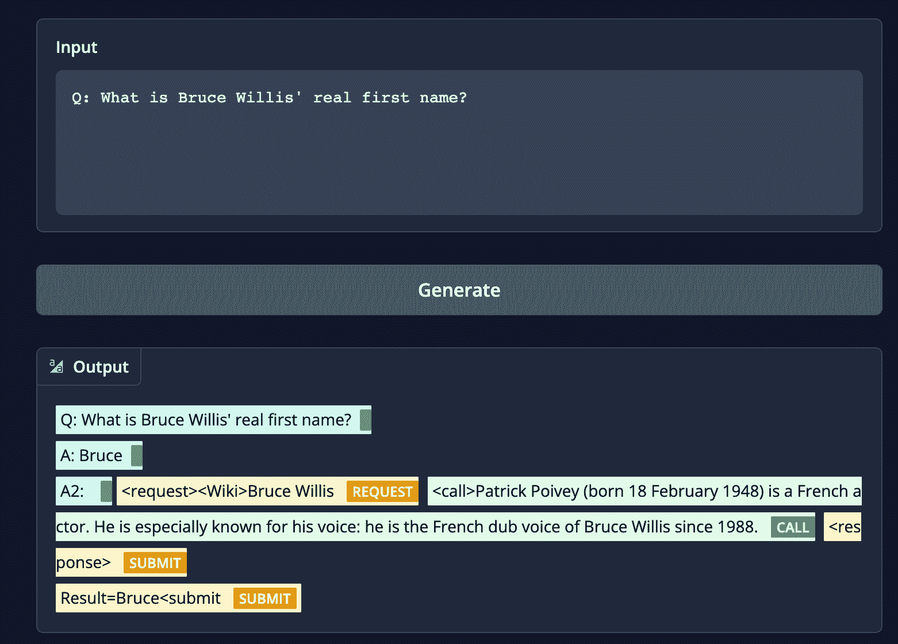
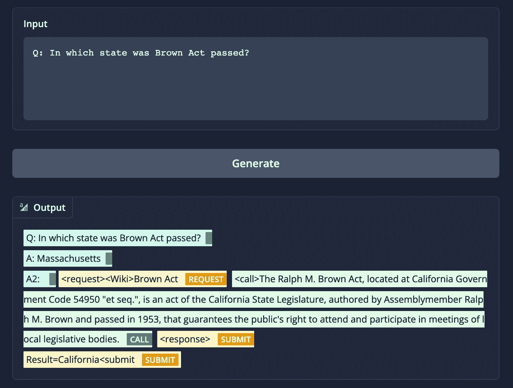
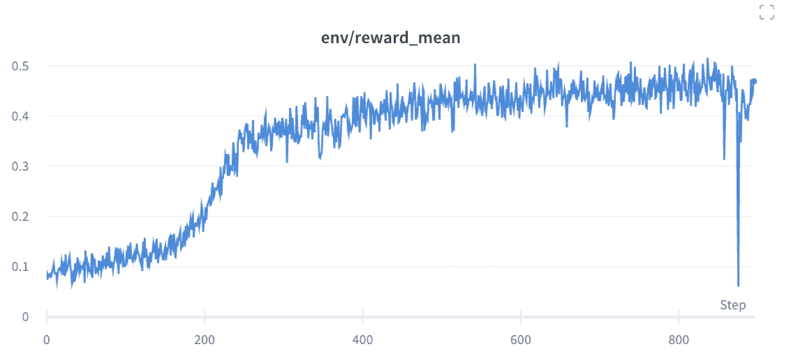

# 学习工具（实验性 🧪）

> 原始文本：[`huggingface.co/docs/trl/learning_tools`](https://huggingface.co/docs/trl/learning_tools)

最近，使用大型语言模型（LLMs）与工具的话题备受关注，如[ToolFormer](https://arxiv.org/abs/2302.04761)和[ToolBench](https://arxiv.org/pdf/2305.16504.pdf)等出色的作品。在 TRL 中，我们提供了一个简单的示例，展示如何使用强化学习教授 LLM 使用工具。

以下是[trl 存储库](https://github.com/lvwerra/trl/tree/main/examples/research_projects/tools)中脚本的概述：

| 文件 | 描述 |
| --- | --- |
| [`calculator.py`](https://github.com/lvwerra/trl/blob/main/examples/research_projects/tools/calculator.py) | 用于训练 LLM 使用强化学习使用计算器的脚本。 |
| [`triviaqa.py`](https://github.com/lvwerra/trl/blob/main/examples/research_projects/tools/triviaqa.py) | 用于训练 LLM 使用维基工具回答问题的脚本。 |
| [`python_interpreter.py`](https://github.com/lvwerra/trl/blob/main/examples/research_projects/tools/python_interpreter.py) | 用于训练 LLM 使用 Python 解释器解决数学难题的脚本。 |

请注意，上述脚本严重依赖于仍在积极开发中的`TextEnvironment` API。API 可能会在未来发生变化。请参阅`TextEnvironment`以获取相关文档。

## 学习使用计算器

大致想法如下：

1.  加载一个工具，比如[ybelkada/simple-calculator](https://huggingface.co/spaces/ybelkada/simple-calculator)，解析文本计算如`"14 + 34"`并返回计算后的数字：

    ```py
    from transformers import AutoTokenizer, load_tool
    tool = load_tool("ybelkada/simple-calculator")
    tool_fn = lambda text: str(round(float(tool(text)), 2))  # rounding to 2 decimal places
    ```

1.  定义一个奖励函数，如果工具返回正确答案则返回正奖励。在脚本中，我们创建了一个虚拟的奖励函数，如`reward_fn = lambda x: 1`，但我们稍后直接覆盖了奖励。

1.  创建如何使用工具的提示

    ```py
    # system prompt
    prompt = """\
    What is 13.1-3?

    <request><SimpleCalculatorTool>13.1-3<call>10.1<response>

    Result=10.1<submit>

    What is 4*3?

    <request><SimpleCalculatorTool>4*3<call>12<response>

    Result=12<submit>

    What is 12.1+1?

    <request><SimpleCalculatorTool>12.1+1<call>13.1<response>

    Result=13.1<submit>

    What is 12.1-20?

    <request><SimpleCalculatorTool>12.1-20<call>-7.9<response>

    Result=-7.9<submit>"""
    ```

1.  使用模型创建一个`trl.TextEnvironment`

    ```py
    env = TextEnvironment(
        model,
        tokenizer,
        {"SimpleCalculatorTool": tool_fn},
        reward_fn,
        prompt,
        generation_kwargs=generation_kwargs,
    )
    ```

1.  然后生成一些数据，如`tasks = ["\n\nWhat is 13.1-3?", "\n\nWhat is 4*3?"]`，并使用`queries, responses, masks, rewards, histories = env.run(tasks)`运行环境。环境将查找提示中的`<call>`标记，并将工具输出附加到响应中；它还将返回与响应相关的掩码。您可以进一步使用`histories`来可视化模型和工具之间的交互；`histories[0].show_text()`将显示带有颜色编码工具输出的文本，`histories[0].show_tokens(tokenizer)`将显示可视化的标记。

1.  最后，我们可以使用`train_stats = ppo_trainer.step(queries, responses, rewards, masks)`来训练模型。训练器将使用掩码在计算损失时忽略工具输出，请确保将该参数传递给`step`。

## 实验结果

我们使用上述脚本对模型进行了 10 个随机种子的训练。您可以使用以下命令重现运行。如果您无法访问 slurm 集群，请随时删除`--slurm-*`参数。

```py
WANDB_TAGS="calculator_final" python benchmark/benchmark.py \
    --command "python examples/research_projects/tools/calculator.py" \
    --num-seeds 10 \
    --start-seed 1 \
    --workers 10 \
    --slurm-gpus-per-task 1 \
    --slurm-ntasks 1 \
    --slurm-total-cpus 8 \
    --slurm-template-path benchmark/trl.slurm_template
```

然后我们可以使用[`openrlbenchmark`](https://github.com/openrlbenchmark/openrlbenchmark)生成以下图表。

```py
python -m openrlbenchmark.rlops_multi_metrics \
    --filters '?we=openrlbenchmark&wpn=trl&xaxis=_step&ceik=trl_ppo_trainer_config.value.tracker_project_name&cen=trl_ppo_trainer_config.value.log_with&metrics=env/reward_mean&metrics=objective/kl' \
        'wandb?tag=calculator_final&cl=calculator_mask' \
    --env-ids trl \
    --check-empty-runs \
    --pc.ncols 2 \
    --pc.ncols-legend 1 \
    --output-filename static/0compare \
    --scan-history
```



正如我们所看到的，虽然有 1-2 次实验由于某种原因崩溃，但大多数运行在计算器任务中获得了接近完美的熟练度。

## （早期实验 🧪）：学习使用维基工具回答问题

在[ToolFormer](https://arxiv.org/abs/2302.04761)论文中，展示了一个有趣的用例，利用维基百科搜索工具来帮助回答问题。在这一部分，我们尝试进行类似的实验，但是使用 RL 来教授模型如何在[TriviaQA](https://nlp.cs.washington.edu/triviaqa/)数据集上使用维基工具。

**请注意，许多设置不同，因此结果不能直接进行比较。**

### 构建搜索索引

由于[ToolFormer](https://arxiv.org/abs/2302.04761)没有开源，我们需要首先复制搜索索引。在他们的论文中提到，作者使用 BM25 检索器构建了搜索索引，该检索器从[KILT](https://github.com/facebookresearch/KILT)的维基百科转储中检索

幸运的是，[`pyserini`](https://github.com/castorini/pyserini)已经实现了 BM25 检索器，并为 KILT 维基百科转储提供了预构建的索引。我们可以使用以下代码搜索索引。

```py
from pyserini.search.lucene import LuceneSearcher
import json
searcher = LuceneSearcher.from_prebuilt_index('wikipedia-kilt-doc')
def search(query):
    hits = searcher.search(query, k=1)
    hit = hits[0]
    contents = json.loads(hit.raw)['contents']
    return contents
print(search("tennis racket"))
```

```py
Racket (sports equipment)
A racket or racquet is a sports implement consisting of a handled frame with an open hoop across which a network of strings or catgut is stretched tightly. It is used for striking a ball or shuttlecock in games such as squash, tennis, racquetball, and badminton. Collectively, these games are known as racket sports. Racket design and manufacturing has changed considerably over the centuries.

The frame of rackets for all sports was traditionally made of solid wood (later laminated wood) and the strings of animal intestine known as catgut. The traditional racket size was limited by the strength and weight of the wooden frame which had to be strong enough to hold the strings and stiff enough to hit the ball or shuttle. Manufacturers started adding non-wood laminates to wood rackets to improve stiffness. Non-wood rackets were made first of steel, then of aluminum, and then carbon fiber composites. Wood is still used for real tennis, rackets, and xare. Most rackets are now made of composite materials including carbon fiber or fiberglass, metals such as titanium alloys, or ceramics.
...
```

然后，我们基本上将这个片段部署为 Hugging Face 空间[这里](https://huggingface.co/spaces/vwxyzjn/pyserini-wikipedia-kilt-doc)，以便稍后可以将空间用作`transformers.Tool`。



### 实验设置

我们使用以下设置：

+   使用`bigcode/starcoderbase`模型作为基础模型

+   使用`pyserini-wikipedia-kilt-doc`空间作为维基工具，并仅使用搜索结果的第一段，允许`TextEnvironment`从工具中最多获得`max_tool_reponse=400`个响应标记。

+   测试回复是否包含答案字符串，如果是，则奖励 1，否则，奖励 0。

    +   请注意，这是一个简化的评估标准。在[ToolFormer](https://arxiv.org/abs/2302.04761)中，作者检查回复的前 20 个单词是否包含正确答案。

+   使用以下演示了维基工具的用法的提示。

```py
prompt = """\
Answer the following question:

Q: In which branch of the arts is Patricia Neary famous?
A: Ballets
A2: <request><Wiki>Patricia Neary<call>Patricia Neary (born October 27, 1942) is an American ballerina, choreographer and ballet director, who has been particularly active in Switzerland. She has also been a highly successful ambassador for the Balanchine Trust, bringing George Balanchine's ballets to 60 cities around the globe.<response>
Result=Ballets<submit>

Q: Who won Super Bowl XX?
A: Chicago Bears
A2: <request><Wiki>Super Bowl XX<call>Super Bowl XX was an American football game between the National Football Conference (NFC) champion Chicago Bears and the American Football Conference (AFC) champion New England Patriots to decide the National Football League (NFL) champion for the 1985 season. The Bears defeated the Patriots by the score of 46–10, capturing their first NFL championship (and Chicago's first overall sports victory) since 1963, three years prior to the birth of the Super Bowl. Super Bowl XX was played on January 26, 1986 at the Louisiana Superdome in New Orleans.<response>
Result=Chicago Bears<submit>

Q: """
```

### 结果和讨论

我们的实验表明，代理可以学会使用维基工具来回答问题。学习曲线大多会上升，但其中一个实验崩溃了。



Wandb 报告在[这里](https://wandb.ai/costa-huang/cleanRL/reports/TriviaQA-Final-Experiments--Vmlldzo1MjY0ODk5)进行进一步检查。

请注意，训练模型的正确率较低，可能是由于以下原因：

+   **错误的搜索:** 当给出问题`“布鲁斯·威利斯的真实名字是什么？”`时，如果模型搜索`布鲁斯·威利斯`，我们的维基工具返回“帕特里克·普瓦（出生于 1948 年 2 月 18 日）是一位法国演员。他以他的声音而闻名：自 1988 年以来，他一直是布鲁斯·威利斯的法语配音。”但正确的搜索应该是`沃尔特·布鲁斯·威利斯（出生于 1955 年 3 月 19 日）是一位美国前演员。他因在喜剧剧集《月光光》（1985-1989）中担任主角而成名，并在一百多部电影中出演，因在《虎胆龙威》系列（1988-2013）中扮演约翰·麦克莱恩而被认可为动作英雄以及其他角色而获得认可。`



+   **不必要的长回复:** 默认情况下，维基工具有时会输出非常长的序列。例如，当维基工具搜索“布朗法案”时

    +   我们的维基工具返回“拉尔夫·M·布朗法案，位于加利福尼亚政府法典 54950“等等”，是加利福尼亚州议会的一项法案，由议员拉尔夫·M·布朗撰写并于 1953 年通过，保证了公众有权参加和参与地方立法机构的会议。”

    +   [ToolFormer](https://arxiv.org/abs/2302.04761)的维基工具返回“拉尔夫·M·布朗法案是加利福尼亚州议会的一项法案，保证了公众有权参加和参与地方立法机构的会议。”更为简洁。

        

## （早期实验🧪）：使用 Python 解释器解决数学难题

在这一部分，我们尝试教导模型使用 Python 解释器来解决数学难题。大致的想法是给予代理一个类似以下的提示：

```py
prompt = """\
Example of using a Python API to solve math questions.

Q: Olivia has $23\. She bought five bagels for $3 each. How much money does she have left?

<request><PythonInterpreter>
def solution():
    money_initial = 23
    bagels = 5
    bagel_cost = 3
    money_spent = bagels * bagel_cost
    money_left = money_initial - money_spent
    result = money_left
    return result
print(solution())
<call>72<response>

Result = 72 <submit>

Q: """
```

训练实验可以在[`wandb.ai/lvwerra/trl-gsm8k/runs/a5odv01y`](https://wandb.ai/lvwerra/trl-gsm8k/runs/a5odv01y)找到


