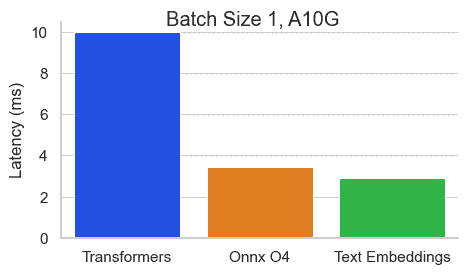
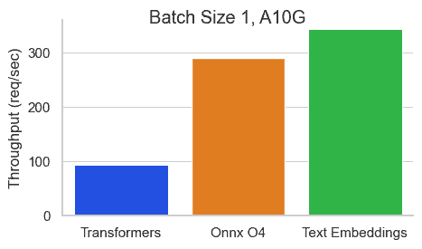
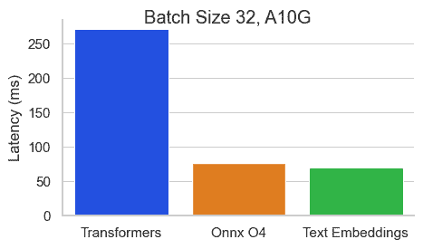
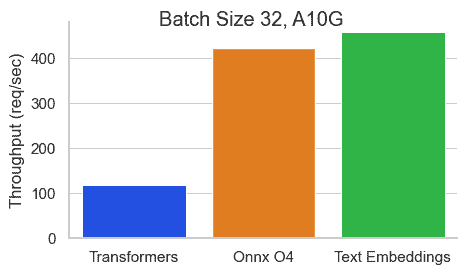

# 文本嵌入推断

> 原始文本：[`huggingface.co/docs/text-embeddings-inference/index`](https://huggingface.co/docs/text-embeddings-inference/index)

文本嵌入推断（TEI）是一个全面的工具包，旨在有效部署和提供开源文本嵌入模型。它实现了对最流行模型的高性能提取，包括 FlagEmbedding、Ember、GTE 和 E5。

TEI 提供了多种功能，旨在优化部署过程并增强整体性能。

**主要特点：**

+   **简化部署：** TEI 消除了模型图编译步骤的需要，实现更高效的部署过程。

+   **资源利用效率高：** 受益于小型 Docker 镜像和快速启动时间，实现真正的无服务器能力。

+   **动态批处理：** TEI 包含基于标记的动态批处理，从而在推断过程中优化资源利用。

+   **优化推断：** TEI 利用[Flash Attention](https://github.com/HazyResearch/flash-attention)、[Candle](https://github.com/huggingface/candle)和[cuBLASLt](https://docs.nvidia.com/cuda/cublas/#using-the-cublaslt-api)，通过使用经过优化的 transformers 代码进行推断。

+   **Safetensors 权重加载：** TEI 加载[Safetensors](https://github.com/huggingface/safetensors)权重，以实现张量并行性。

+   **生产就绪：** TEI 支持通过 Open Telemetry 和 Prometheus 指标进行分布式跟踪。

**基准测试**

在 NVIDIA A10 上对[BAAI/bge-base-en-v1.5](https://hf.co/BAAI/bge-large-en-v1.5)进行基准测试，序列长度为 512 个标记：

 

 

**入门指南：**

要开始使用 TEI，请查看快速入门指南。
