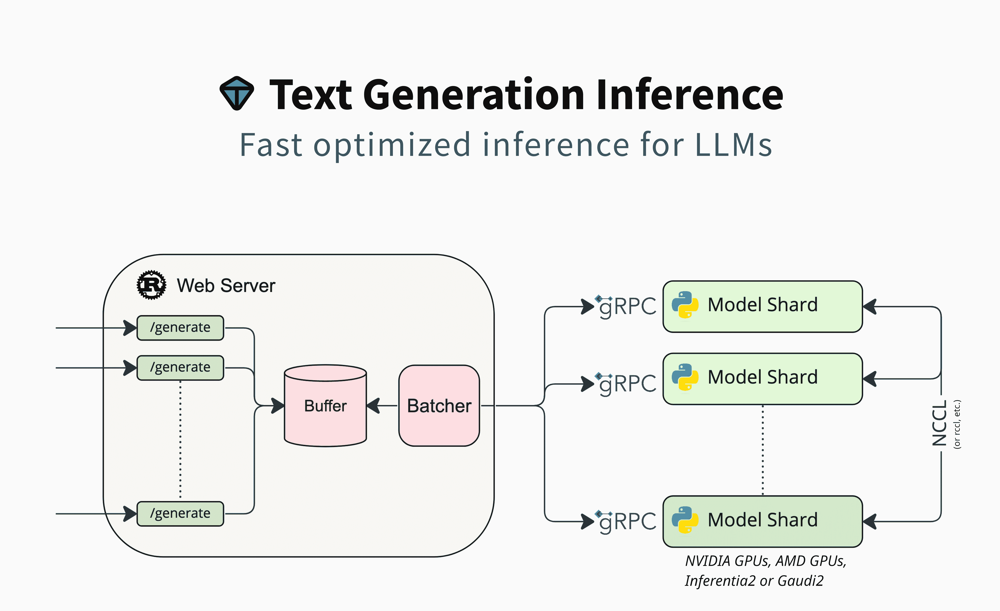

# 文本生成推理

> 原始文本：[`huggingface.co/docs/text-generation-inference/index`](https://huggingface.co/docs/text-generation-inference/index)

文本生成推理（TGI）是一个用于部署和提供大型语言模型（LLMs）的工具包。TGI 实现了最流行的开源 LLMs，包括 Llama、Falcon、StarCoder、BLOOM、GPT-NeoX 和 T5 的高性能文本生成。

文本生成推理实现了许多优化和功能，例如：

+   简单的启动器来提供最流行的 LLMs

+   生产就绪（使用 Open Telemetry 进行分布式跟踪，Prometheus 指标）

+   张量并行性，用于在多个 GPU 上进行更快的推理

+   使用服务器发送事件（SSE）进行令牌流

+   连续批处理传入请求，以增加总吞吐量

+   优化的变压器代码，使用[Flash Attention](https://github.com/HazyResearch/flash-attention)和[Paged Attention](https://github.com/vllm-project/vllm)在最流行的架构上进行推理

+   使用[bitsandbytes](https://github.com/TimDettmers/bitsandbytes)和[GPT-Q](https://arxiv.org/abs/2210.17323)进行量化

+   [Safetensors](https://github.com/huggingface/safetensors)权重加载

+   使用[A Watermark for Large Language Models](https://arxiv.org/abs/2301.10226)进行水印处理

+   对数变形器（温度缩放，前 p，前 k，重复惩罚）

+   停止序列

+   对数概率

+   自定义提示生成：通过提供自定义提示来引导模型的输出，轻松生成文本。

+   微调支持：利用微调模型来实现更高的准确性和性能。

文本生成推理已被多个项目用于生产，例如：

+   [Hugging Chat](https://github.com/huggingface/chat-ui)，一个用于开放访问模型的开源界面，如 Open Assistant 和 Llama

+   [OpenAssistant](https://open-assistant.io/)，一个开源社区努力，用于在开放环境中训练 LLMs

+   [nat.dev](http://nat.dev/)，一个用于探索和比较 LLMs 的游乐场。
