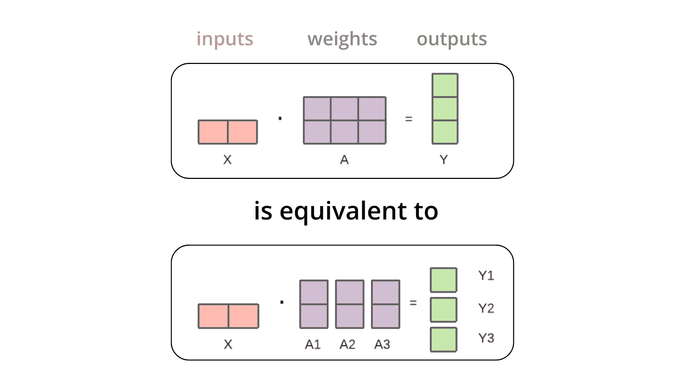

# 张量并行

> 原文链接: [`huggingface.co/docs/text-generation-inference/conceptual/tensor_parallelism`](https://huggingface.co/docs/text-generation-inference/conceptual/tensor_parallelism)

张量并行是一种技术，用于在多个 GPU 中适配大型模型。例如，当将输入张量与第一个权重张量相乘时，矩阵乘法等同于按列拆分权重张量，分别将每列与输入相乘，然后将单独的输出连接起来。这些输出然后从 GPU 传输并连接在一起以获得最终结果，如下所示👇

张量并行仅适用于官方支持的模型，当回退到`transformers`时将无法使用。您可以在这里获取有关不受支持模型的更多信息。

您可以从[transformers 文档](https://huggingface.co/docs/transformers/main/en/perf_train_gpu_many#tensor-parallelism)中了解更多有关张量并行的详细信息。
